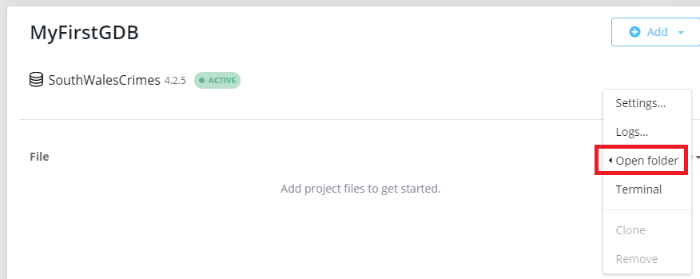

# CrimeScripts_neo4j

## Authors 
- Simon Schønberg Bojesen 
- Frederik Blem 
- Kenneth Hansen 
- Martin Høigaard Cupello

## How to run
1. First things first you gotta create a DB in Neo4j desktop, and start it.
2. The second thing you need to do is download the data file:
[data](data/2021-02-south-wales-street.csv)
3. On the Neo4j dashboard inside the project you created the database, click "..." on the DB -> "Open folder" -> "Import"

